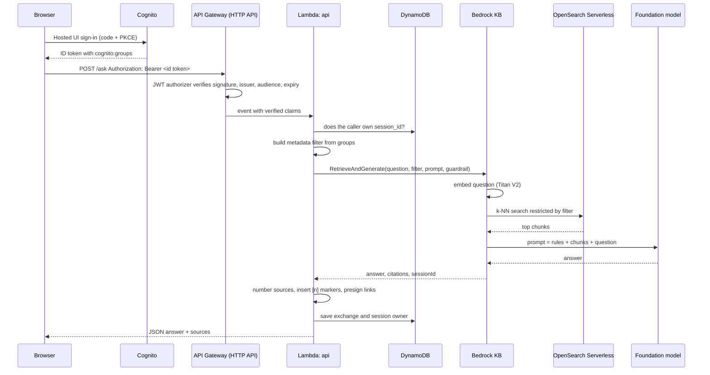
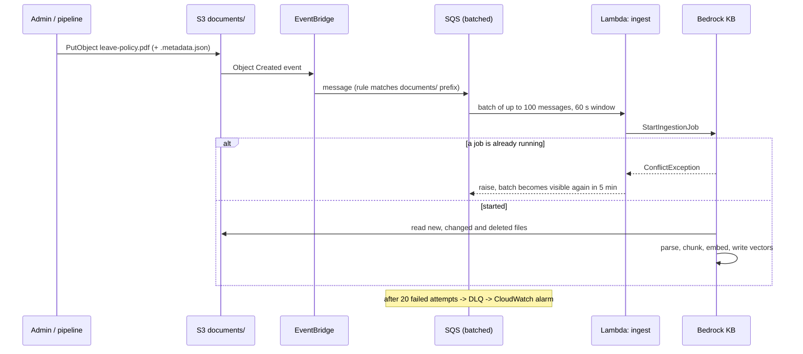

# Architecture and design decisions

## 1. Query flow (one question)

## 2. Ingestion flow (one upload)

## 3. Design decisions

**Managed RAG (`RetrieveAndGenerate`) instead of hand-built orchestration.** Parsing, chunking, embedding, retrieval, prompt assembly, citations and session memory are all handled by the Knowledge Base. The Lambda stays about 150 lines and is easy to teach. The `Retrieve` API is the escape hatch when you need full control (custom prompting per department, streaming, a non-Bedrock model); `rag.build_request` is the only place that would change.

**Metadata filtering for authorization, built from verified claims.** The filter is the security boundary, so it's derived only from the JWT the authorizer already verified. The request body can't influence it. For content that must never be co-located (legal holds, board papers), deploy a separate knowledge base.

**OpenSearch Serverless with faiss.** Faiss is required for filtered k-NN search in Bedrock Knowledge Bases. The index mapping ignores later changes because Bedrock adds a field per metadata key during ingestion; without `ignore_changes`, the next apply would replace the index and wipe the vectors.

**`data_deletion_policy = "RETAIN"`.** On `terraform destroy`, Bedrock would otherwise try to delete vectors from an index Terraform may already have removed, and the destroy would fail.

**SQS between EventBridge and the ingest Lambda.** A data source runs one ingestion job at a time and syncs are incremental. Batching turns a 500-file upload into one or two jobs; SQS retries handle the "job already running" case without custom state.

**HTTP API rather than REST API.** Cheaper, lower latency, and a native JWT authorizer. Trade-offs: no API keys or usage plans, no direct WAF attachment (WAF sits on CloudFront instead), and a 30-second integration timeout.

**Session ownership in DynamoDB.** Bedrock session IDs aren't tied to a user. Recording `USER# / SESSION#<id>` and checking it before reuse prevents one user from continuing another user's conversation.

**Presigned source links.** Sources are only returned for chunks the user was allowed to retrieve, so linking to the underlying file is safe. Links expire after 5 minutes.

**One Lambda package, two handlers.** Shared code, one build step, one artifact to scan.

## 4. Production hardening checklist

- Replace the public OpenSearch network policy with a VPC endpoint, and run Lambda in private subnets with VPC endpoints for Bedrock, DynamoDB, S3 and KMS.
- Narrow `bedrock:InvokeModel` from `foundation-model/*` to the specific model IDs behind your inference profile.
- Add a custom domain with ACM certificates for CloudFront and API Gateway, and update CORS and Cognito callback URLs.
- Federate Cognito with your corporate identity provider (SAML or OIDC) and map IdP groups to Cognito groups.
- Enable Bedrock model invocation logging to S3 (with the KMS key) for audit.
- Enable `enable_waf`, and set `force_destroy = false` and Cognito deletion protection.
- Store Terraform state in S3 with DynamoDB locking (see `versions.tf`).
- Run `make evaluate-full` in CI after each document batch and fail the pipeline on any access leak.

## 5. Extensions for students

| Extension | Where to change |
| --- | --- |
| Streaming answers token by token | Lambda function URL with response streaming, calling `retrieve_and_generate_stream` |
| Hierarchical or semantic chunking | `vector_ingestion_configuration` in `bedrock.tf` |
| S3 Vectors instead of OpenSearch | `opensearch.tf` and `storage_configuration` in `bedrock.tf` |
| Per-department prompt templates | `rag.PROMPT_TEMPLATE`, selected by `user.departments` |
| Feedback dashboard | DynamoDB export to S3 and Athena, or a CloudWatch Logs Insights query on `answered` events |
| Upload portal for document owners | A presigned-POST endpoint restricted to the `admin` group |
